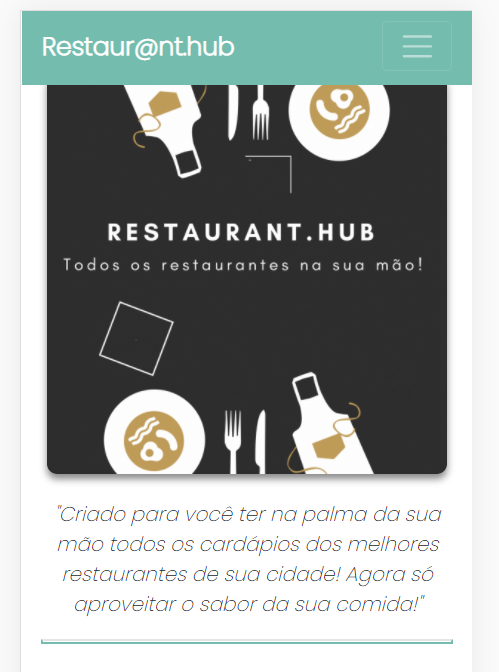

##### Click [here](https://restaurant-hub.herokuapp.com/) to access **Restaurat.Hub**  :boom: Attention - This application is only mobile. 

##### Slides - Click [here]() To see the presentation of the project. 
---

## Table of contents
* [General info](#general-info)
* [Technologies](#technologies)
* [Setup](#setup)

## General info
This project has the goal to present the knowledge learned on the third module of the Web Development Full Stack. 

It was created a application mobile which is about a hub of menu of restaurants that has some features and is linked in a Api created in Node.js Mongoose, Express and others.
##### Click [here](https://github.com/henriquefb08/rest-api-restaurant.hub/tree/main) to access **the API**

## Technologies
Project is created with:

* axios -  0.21.1
* bootstrap - 4.6.0
* react:  - 17.0.2
* react-bootstrap -  1.5.2
* react-dom - 17.0.2
* react-router-dom -  5.2.0

## Setup
To run this project, install it locally using npm:

$ cd ../lorem
$ npm install
$ npm start

### Restaur@nt.Hub Features
--- 
#### Consumer Features
+ Signup Page 
	+ Name
	+ Email
	+ Passaword
	+ Description
+ Login Page
+ Main Page with restaurant list
+ Perfil ediction
--
#### Restaurant Features
+ Signup Page 
	+ Name
	+ Email
	+ Passaword
	 + Category
	+ Description
+ Login Page
+ Main Page
	+ Add new Item
	+ Delete a Item
+ Perfil ediction
---
